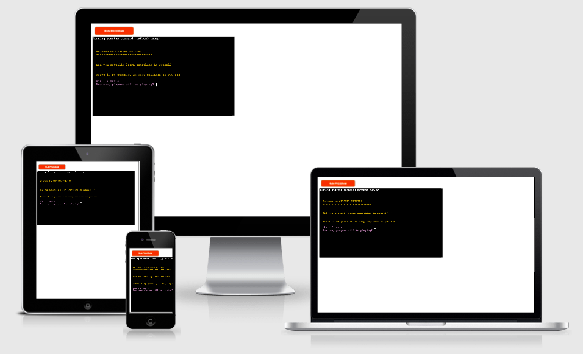
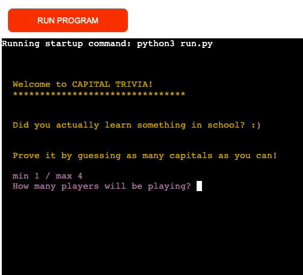
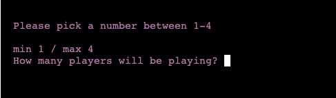
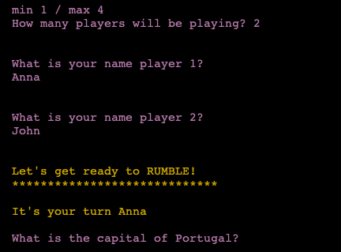
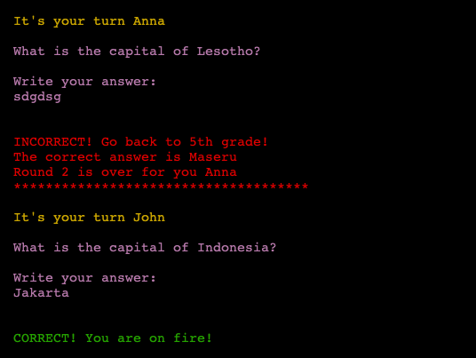
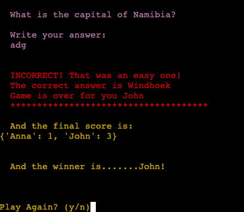
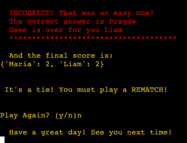
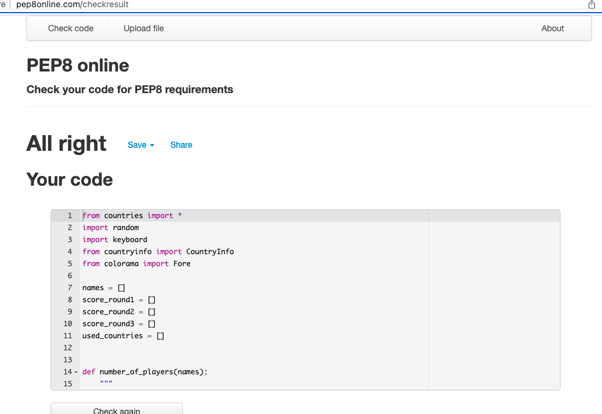
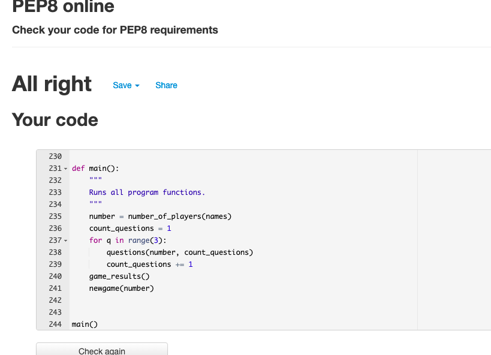

## Capitals Trivia
* Capitals Trivia is a Python terminal game, that runs in the Code Institute mock terminal in heroku

* Users will play against each other. The game will ask for capital cities of random countries
and will get a point every time a player gets a correct answer. There are three rounds. Every time
a player gets an incorrect answer it will be the turn of the next player. If the player gets a correct answer, he/she will be keep playing and adding points until they fail.

### How to Play

* When the terminal has loaded the user will have a welcoming message and it will be asked to write the amount of players that will be playing the game. Minimum 1 player is required and maximum 4 players. If it is only one player, pretty much this player will be testing itself, practicing. 
If the input from the user is incorrect the game will ask the player to put a number between 1-4.

* Once a number of players has been placed, each player will have to write down its name in order to continue. The players need to write down at least two characters names in order to continue. 

### Features

### Existing Features

#### Random Questions
* The first player is called for action. The game will make a question selected randomly from a list of countries
* If the player gets a correct answer it will receive a new randome question. If the answer is incorrect the next player will be called to answer a random question. Questions that have been answered correctly won't be appearing again in the quiz. 

![controllers/photos/photo_4.png]

#### Feedback
* The game will give a positive feedback message if the answer is correct and it will give a negative feedback if the answer is incorrect. It will also print the correct answer in order to make it educational. 

#### Score count and final results
* The users score is adding up so in the end it will return all the scores and it will specify who is the winner or if there is a tie it will recommend a rematch. 

#### Play again or exit
* At the end of every game the users will be asked if they want to play another game with a pretty straight forward y/n answer. If the answer is y, a new game will start from scratch. If the answer is n, there will be a have a nice day message and ends the program. 

### Future Features

* The one player option will be more of a training mode where the user gets infinite questions until it decides to quit.
* Players can create their own lists of countries for the others players to guess. 
* Let the players decide how many rounds they would like to play.

### Data Model

* I decided to work with functions. I tried to make the functions as atomic as possible. The number_of_players functions registers the players, the questions function controls the flow of the game and the game_result function gets the scores of every player and it gives us a final result. 

* I added different functions in order to validate the user's input and to make sure the questions wouldn't repeat. 

### Testing

#### I have manually tested the project by doing the following:

* Passed the code through a PEP8 linter to make sure there are no errors or warnings in my code
* I gave it invalid inputs when numbers or characters are expected
* Tested my local terminal and the Code Institute Heroku terminal

### Bugs

* One of the main challenges I had while running the project was to get a total result in order to print a winner. On the questions function, there is a score = 0 variable and also a score += 1 inside the while loop. I had a score_round.append every time there was a correct answer and it was adding the points twice so I removed the else ifs to the lower part with the incorrect answers. 

* I imported a file with capitals of the world and a file with countries of the world. It was very hard to find a list with countries of the world and the only one I found, had the official name which is longer and wouldn't match with the data from my capitals list. I fixed this by creating my own list and removed names that would not match the imported capitals library. 

### Remaining Bugs

* No bugs remaining

### Validator testing

* PEP8 --- No errors returned from PEP8online.com 

### Deployment

* This project was deployed using the Code Institute's mock terminal for Heroku.
* Steps for deployment:
  + Fork or clone this repository
  + Creat a new Heroku app
  + Set the buildbacks to Python and Nodejs in that order
  + Added Key PORT 8000
  + Link the Heroku app to the repository
  + Click on deploy
  + Open the app to confirm everything is up and runnning

### Credits

* Code Institute for the deployment terminal 
* W3 Schools where I got support from the community
* Code Institute Slack community
* Colorama and Country Info libraries that I imported in order to be able to create the game

 

